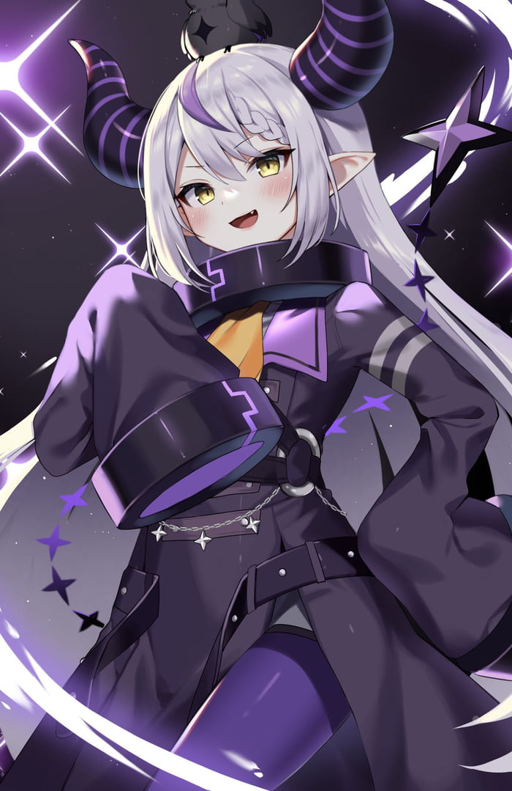

# EDS124BR
EDS124BR portfolio  
Fangqi Yuan  
  

Show What You Know: Explain Your Program Video(click the image to check the video):   
    

Repeats: Write a Program(click the image to check the video):   
    

Teaching Programming Portfolio - Lesson Plan(click the image to check the video):   
    

Show What You Know: Write and Explain A Program(click the image to check the video):   
    

Show What You Know: Event(click the image to check the video):   
    

Show What You Know: Write and Explain A Program(click the image to check the video):   
    

Show What You Know: Conditional loop(click the image to check the video):   
    

Show What You Know: If-else(click the image to check the video):   
    

Show What You Know: Nested-If-else(click the image to check the video):   
  

Show What You Know: Compound-If(click the image to check the video):   
  

Show What You Know: Abstraction(click the image to check the video):   
  

Show What You Know: Abstraction(click the image to check the video):   
  
